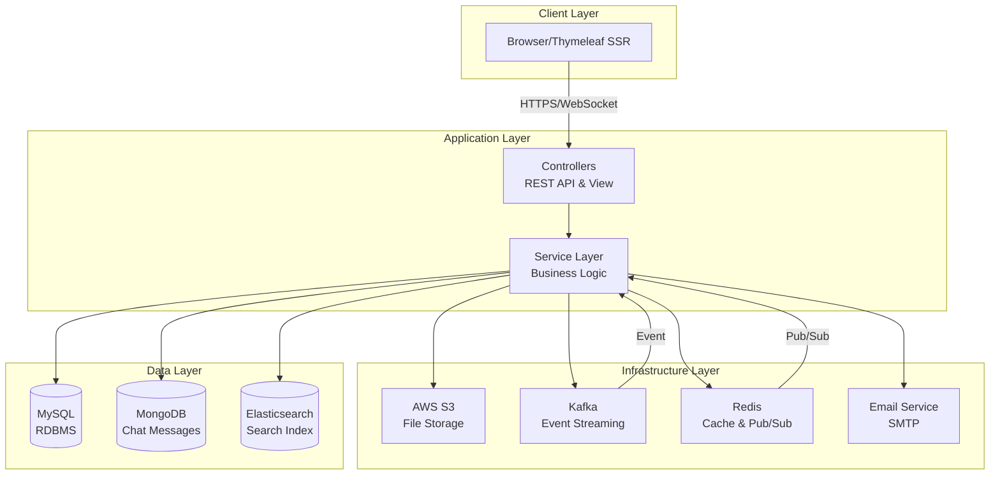
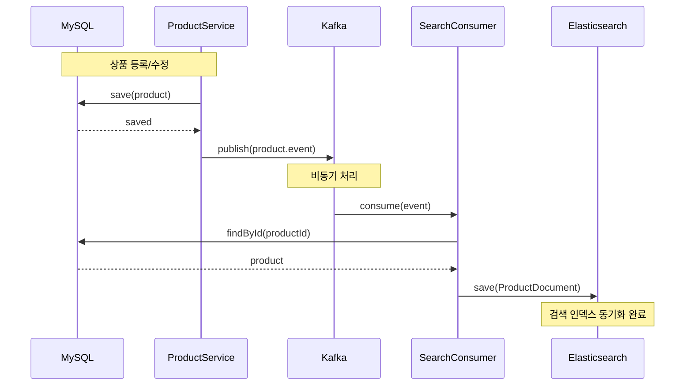
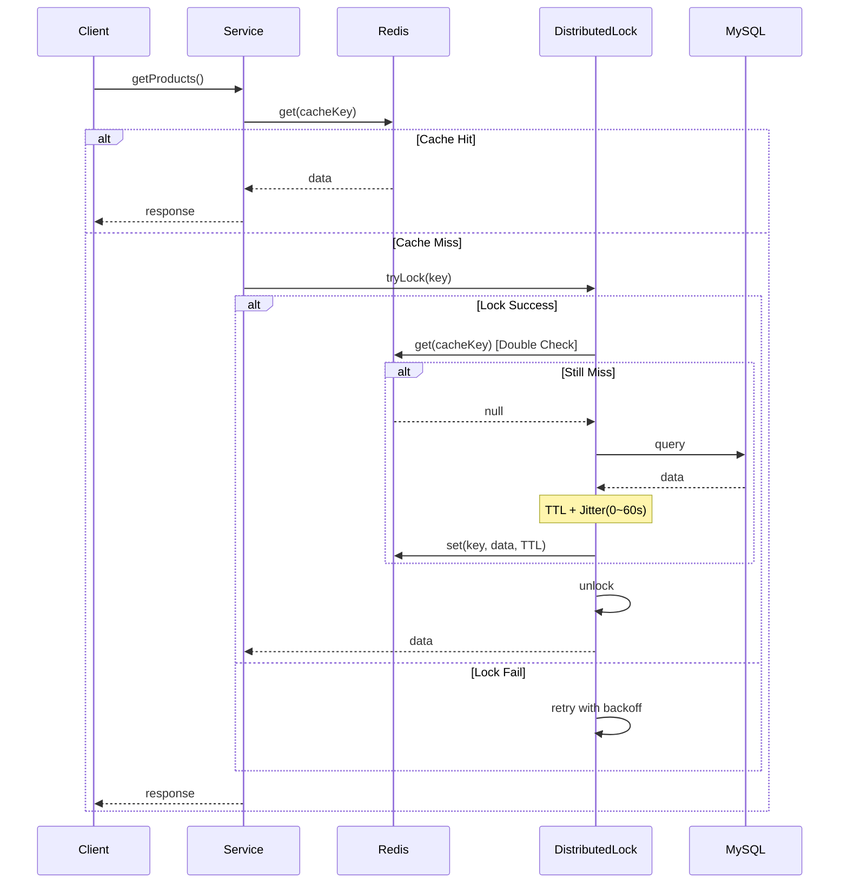
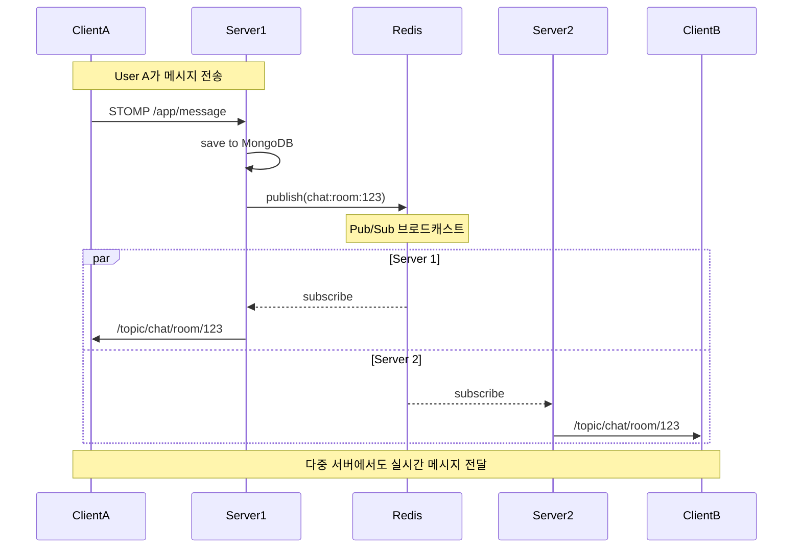
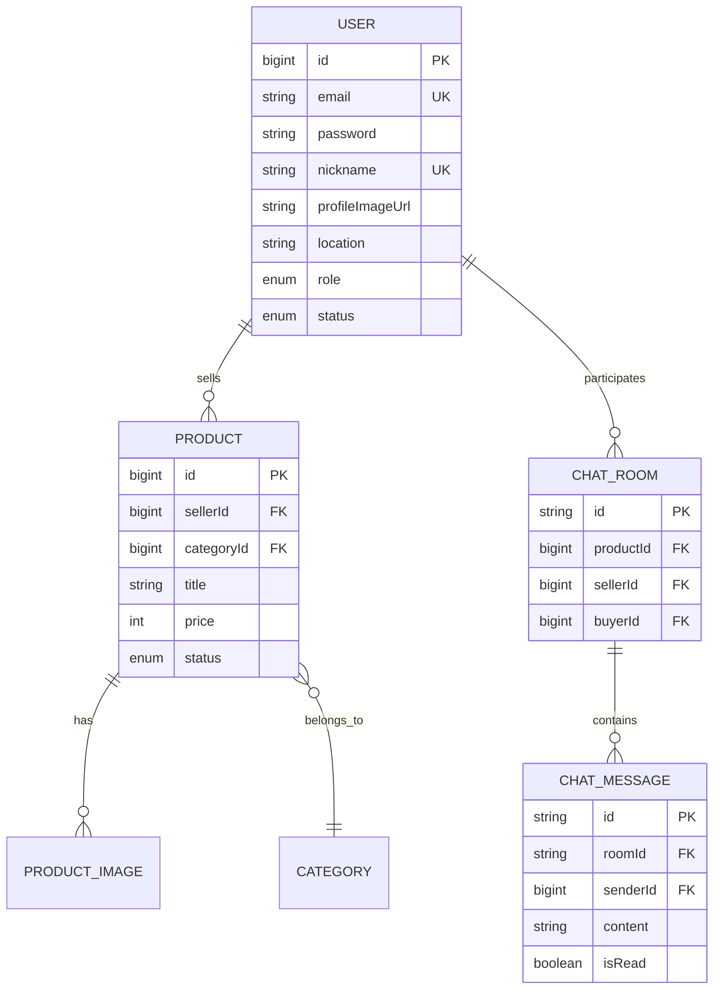

# 🥕 Carrot Market - 중고거래 플랫폼

Spring Boot 기반의 중고거래 플랫폼으로, **이벤트 기반 아키텍처**와 **Polyglot Persistence**를 활용한 확장 가능한 모놀리식 애플리케이션입니다.

## 📋 목차
- [주요 기능](#-주요-기능)
- [기술 스택](#-기술-스택)
- [아키텍처](#-아키텍처)
- [핵심 기술 구현](#-핵심-기술-구현)
- [실행 방법](#-실행-방법)
- [API 문서](#-api-문서)

---

## ✨ 주요 기능

### 1. 사용자 관리
- 회원가입 및 이메일 인증 (Kafka 비동기 처리)
- JWT 기반 인증 (AccessToken + RefreshToken)
- BCrypt 비밀번호 암호화 (Salt Round 10)

### 2. 상품 관리
- 상품 등록/수정/삭제 (이미지 최대 5개)
- 카테고리별 상품 조회
- Redis 캐싱 (Cache-Aside + Distributed Lock)
- S3 이미지 업로드 및 썸네일 생성

### 3. 검색 기능
- Elasticsearch + Nori Analyzer (한국어 형태소 분석)
- 키워드, 카테고리, 가격 범위 필터링
- 실시간 검색 인덱스 동기화 (Kafka)

### 4. 실시간 채팅
- WebSocket (STOMP) 기반 실시간 메시지
- Redis Pub/Sub로 다중 서버 지원
- MongoDB 메시지 저장
- 읽음 처리 및 알림 기능

---

## 🛠 기술 스택

### Backend
- **Java 21** | **Spring Boot 3.5.9**
- **Spring Security** | **JWT**
- **Spring Data JPA** | **Spring Data MongoDB** | **Spring Data Elasticsearch**

### Database & Cache
- **MySQL 8.0** - 메인 데이터베이스
- **MongoDB 8.0** - 채팅 메시지 저장
- **Redis 8.2** - 캐싱 & Pub/Sub
- **Elasticsearch 8.1** - 검색 엔진

### Messaging & Storage
- **Kafka 4.1** - 이벤트 스트리밍
- **AWS S3** - 파일 저장
- **CloudFront** - CDN

### Monitoring
- **Prometheus** - 메트릭 수집
- **Grafana** - 시각화

### Test
- **JUnit 5** - 단위 테스트
- **Testcontainers** - 통합 테스트

---

## 🏗 아키텍처

### 전체 시스템 구조



### 계층형 아키텍처
```
├── Presentation Layer (Controller)
│   ├── REST API Controller
│   ├── View Controller (Thymeleaf)
│   └── WebSocket Handler
│
├── Business Layer (Service)
│   ├── User Service
│   ├── Product Service
│   ├── Chat Service
│   └── Search Service
│
├── Data Access Layer (Repository)
│   ├── JPA Repository (MySQL)
│   ├── MongoDB Repository
│   └── Elasticsearch Repository
│
└── Infrastructure Layer
    ├── S3 Service
    ├── Kafka Producer/Consumer
    ├── Redis Cache
    └── Email Service
```

---

## 🎯 핵심 기술 구현

### 1. 이벤트 기반 데이터 동기화 (Kafka)

**느슨한 결합 & 실시간 동기화**



**특징:**
- DB와 검색 엔진 간 느슨한 결합
- 장애 격리 (Elasticsearch 장애 시에도 상품 등록 성공)
- DLQ (Dead Letter Queue) 구현 (3번 재시도 후 실패 시 DLQ로 전송)

### 2. 캐싱 전략 & Cache Stampede 방지 (Redis)

**Distributed Lock + Jitter로 DB 보호**



**특징:**
- Cache Stampede 방지 (동시 다발적 DB 조회 차단)
- Distributed Lock으로 단일 스레드만 DB 조회
- Jitter로 캐시 만료 시점 분산 (Thundering Herd 방지)

### 3. 실시간 채팅 메시지 흐름 (WebSocket & Redis Pub/Sub)

**Scale-out 환경에서 메시지 전달**



**특징:**
- 다중 서버 환경(Scale-out)에서 메시지 유실 방지
- Redis Pub/Sub로 서버 간 통신
- WebSocket으로 실시간 양방향 통신

---

## 🚀 실행 방법

### 1. 사전 요구사항
- Java 21
- Docker & Docker Compose

### 2. 인프라 실행
```bash
docker-compose up -d
```

**실행되는 서비스:**
- MySQL (3306)
- MongoDB (27017)
- Redis (6379)
- Elasticsearch (9200)
- Kafka (9092)
- Prometheus (9090)
- Grafana (3000)

### 3. 애플리케이션 실행
```bash
./gradlew bootRun
```

### 4. 접속
- **애플리케이션**: http://localhost:8080
- **Swagger UI**: http://localhost:8080/swagger-ui/index.html
- **Grafana**: http://localhost:3000 (admin/admin)

---

## 📚 API 문서

### Swagger UI
애플리케이션 실행 후 http://localhost:8080/swagger-ui/index.html 에서 확인 가능

### 주요 API 엔드포인트

#### 사용자
- `POST /api/users/signup` - 회원가입
- `POST /api/auth/login` - 로그인
- `GET /api/users/email-verify` - 이메일 인증

#### 상품
- `POST /api/products/new` - 상품 등록
- `GET /products` - 상품 목록 조회
- `GET /products/{id}` - 상품 상세 조회
- `PATCH /api/products/{id}/edit` - 상품 수정

#### 검색
- `GET /search?q={keyword}` - 상품 검색

#### 채팅
- `POST /api/chats/rooms` - 채팅방 생성
- `GET /chats/rooms` - 채팅방 목록
- `WebSocket /ws-chat` - 실시간 채팅

---

## 📊 데이터베이스 ERD



---

## 🎓 학습 포인트

### 1. 아키텍처 설계
- ✅ 계층형 아키텍처 (Layered Architecture)
- ✅ 이벤트 기반 아키텍처 (Event-Driven Architecture)
- ✅ Polyglot Persistence (MySQL + MongoDB + Elasticsearch)

### 2. 디자인 패턴
- ✅ SOLID 원칙 준수
- ✅ DI (Dependency Injection) 활용
- ✅ 중앙 집중식 예외 처리 (@RestControllerAdvice)

### 3. 성능 최적화
- ✅ Redis 캐싱 전략 (Cache-Aside, Distributed Lock, Jitter)
- ✅ N+1 문제 해결 (JOIN FETCH)
- ✅ 비동기 처리 (Kafka, @Async)

### 4. 보안
- ✅ JWT 인증 (AccessToken + RefreshToken)
- ✅ BCrypt 비밀번호 암호화
- ✅ CSRF 토큰 보호

### 5. 테스트
- ✅ 단위 테스트 (JUnit 5)
- ✅ 통합 테스트 (Testcontainers)
- ✅ Slice 테스트 (@DataJpaTest, @WebMvcTest)

---

## 📝 라이센스

This project is licensed under the MIT License.

---

## 👤 Author

**Your Name**
- GitHub: [@chiyomomo56562](https://github.com/chiyomomo56562)
